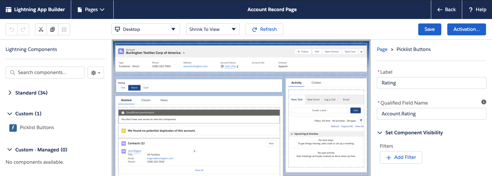
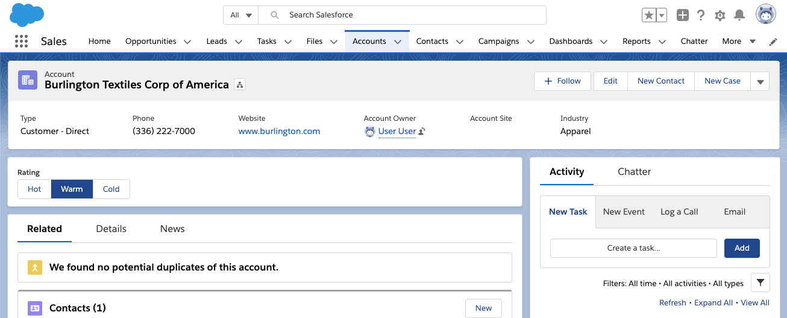

# A LWC picklist buttons component that works with any picklist field

This component provides an alternative to the [standard built-in Path feature](https://help.salesforce.com/articleView?id=path_overview.htm&type=5).<br/>
It's interesting to use it for picklist that hold alternate values rather than values that reflect a progression of stages.


The component runs entirely on the Lightning Data Service and requires no Apex.


## Install
If you are on MacOS or Linux, run

```
sh install.dev
```

Otherwise, type the following commands:


1. Create a scratch org and provide it with an alias (**path** in the command below):

```
sfdx force:org:create -s -f config/project-scratch-def.json -a pl-buttons
```

2. Push the app to your scratch org:

```
sfdx force:source:push
```

3. Open the scratch org:

```
sfdx force:org:open
```

## Configuration
1. Edit a record page with the **Lighning App Builder**
1. Place the **Picklist Buttons** component on the page.
2. Set the **Qualified Field Name** parameter to one of the object picklist field. The field name must be qualified (eg: `Account.Rating` or `Dummy__c.Stage__c`).


<br/>
<br/>
